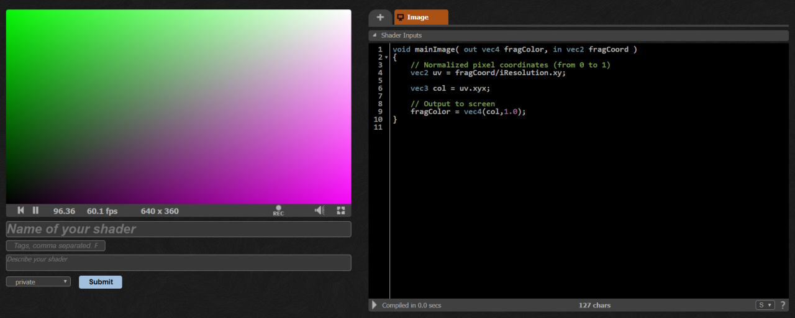
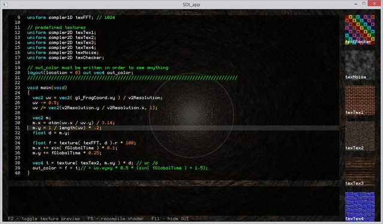
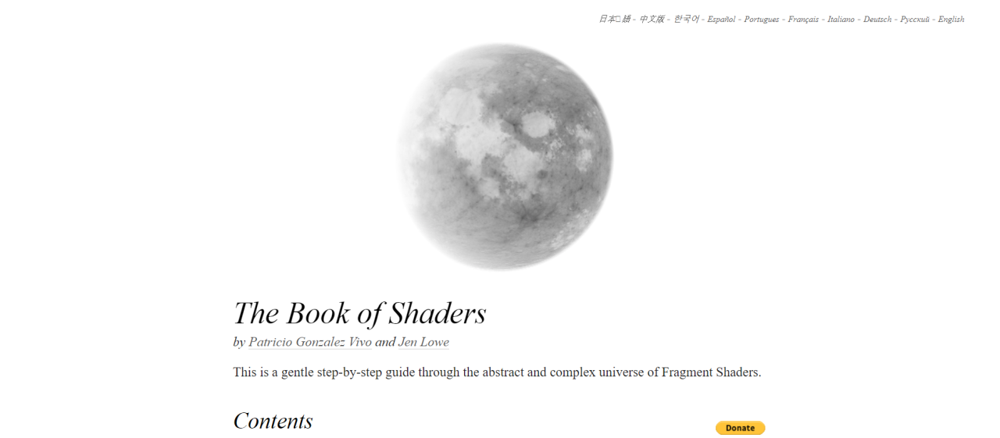

## Recommended materials and libraries for Shader learning

Why learn shader programming? The answer is simple, it depends on if you'd enjoy creating awesome graphics.
This is one method to utilze the full potential of your GPU's massive CPU cluster and capabilities.

The cover image for this blog post is called **Refracted brutalism** by [evvvvil](https://twitter.com/evvvvil)
and it was with 96 lines of code only. It's rather compressed though, and could look intimidating at first, but you can unpack this step by step.

There's a conceptual difference when drawing with HTML canvas and painting with a pixel shader.The main distinction is executing shaders is a massively parallel process. This comes with an interesting conseqence that


Link to shader: https://www.shadertoy.com/view/wt33RN

This site is ShaderToy which doesn't need introdction to many in the graphics community. This site is already an amazing learning resource, but one probably doesn't want to start here.

## Development environment

Good craftmanship requires lots of practice, but more importantly, good tooling. Learning these techniques also require you to get your hands dirty.

And by dirty I mean really knee deep in tinkering.

You have a few options if you want to experiment with shader coding:

- Write it on ShaderToy
- Use local tools with GLSLCanvas
- Use desktop tool, Bonzomatic

### Use ShaderToy's editor



https://www.shadertoy.com/new

### GLSLCanvas

It's good to try out and save the result of our work with our already existing development environment. The GLSLCanvas library helps us tremendously because we can experiment in our browser easily.

https://github.com/patriciogonzalezvivo/glslCanvas

I use it with Parcel to enable live reload with a simple html backbone.

```javascript
/**
 * Shader loading
 */
import GlslCanvas from 'glslCanvas';
import shader from './hello-world.glsl';

const width = 800;
const height = 480;
const canvas = document.createElement('canvas');

canvas.width = width / window.devicePixelRatio;
canvas.height = height / window.devicePixelRatio;

var sandbox = new GlslCanvas(canvas);
sandbox.load(shader);

document.body.appendChild(canvas);
```

Include this file in an empty HTML file and use Parcel to launch it:

```bash
# install parcel first
npm i -g parcel-bundler

# launch the environment with local server
parcel index.html --open
```

### Bonzomatic

If you prefer coding outside the browser, then this is your weapon. It's a minimalistic live coding environment which is used by many streamers and live codeing competitions or parties.

It's developed by demoscene veteran [Gargaj](http://www.pouet.net/user.php?who=1007)




## Reference

Don't forget to RTFM when in doubt how GLSL functions work:

https://www.khronos.org/opengles/sdk/docs/manglsl/docbook4/


# Syllabus

## 1) The Book of Shaders



https://thebookofshaders.com/

To get started, The Book of Shaders by **Patricio Gonzalez Vivo** and **Jen Lowe** is a great point to get familiar with the basic concepts it didn't expand in the intro section. It's available in 10 languages and has an interactive code editor in each chapter.


## 2) The Art of Code YouTube channel

https://www.youtube.com/channel/UCcAlTqd9zID6aNX3TzwxJXg

It's good to alternatve between written explanation and demonstration of the subject. This Channel is by Martijn aka. [BigWIngs](https://www.shadertoy.com/user/BigWIngs).

He explains advanced concepts like it's a walk in the park, like raymarching. That technique was used in the cover image of this post.

## Exercises

