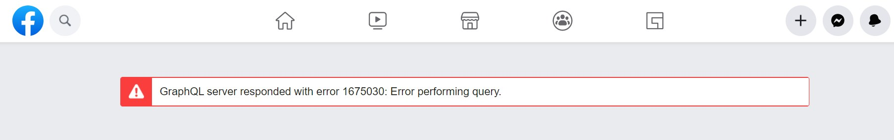

Backing up your data is in theory a rather simple process. You just copy bits from one place to another. This data usually consists of your pictures, videos, documents, scans, music, etc. There are tons of existing solutions out there to keep your data safe, but where are all this data exactly?

Usually in these places:

-   Local hard drive
-   A cloud storage provider, like Google, Apple or Huawei
-   Social media platforms

Local hard drives are the easy ones. You can go from making manual copies from time to time to having a cloud provider do it for you automatically, like Backblaze. I picked the latter one, it's an _"install once and forget about it"_ way to have some peace of mind.

When you take pictures with your phone or make notes, data gets synced to the cloud automatically. This is ideally what you want, but there's a catch. Your account can be hacked, banned or you can lose access in other ways, like data loss by the provider. There are also solutions to back up your cloud too. You can go from making manual backups of your [Google data](https://takeout.google.com/settings/takeout) or picking another cloud drive provider which can import from these services like pCloud.

### Great, what about social media?

Remember, that your account can be [suspended](https://qz.com/651001/getting-banned-from-facebook-can-have-unexpected-and-professionally-devastating-consequences/) or [permanently banned](https://twitter.com/CixLiv/status/1320068735730733056) by the platforms you use and [if you can't](https://news.ycombinator.com/item?id=22695407) [raise awareness](https://reclaimthenet.org/bret-weinstein-facebook-disabled/) to it [in popular media](https://www.theguardian.com/global-development/2020/jun/04/facebook-deactivates-accounts-of-tunisian-political-bloggers-and-activists), then [you are toast](https://www.elliott.org/blog/banned-from-facebook-permanently-how/).

[Facebook data download](https://www.facebook.com/dyi/) is a thing and it gives you an option to download most of you stuff you posted to Facebook. Or at least it should, because at the moment of writing this, I'm getting the following error, which further proves my point:

Let's say you have successfully got all your pics, videos, contact list and small banters about a cats, political rants and those precious likes?

> There's one thing you can't export and it's also happen to be the most valuable thing of Facebook: Your social graph.

Isn't that network of friends is just a fancy contact list?

Well, yes and no. The data export contains a list of friends, but if you want their contact information then your new rolodex will look like a desert where the good the bad and the ugly are playing with a tumbleweed. Not great.

The situation to reach them will also turn on its head. Sending stuff to them will not be simple anymore. Manually picking what to share to them via a new platform is tedious to say the least. It'll be also kinda weird to send an unsolicited video about [a cat playing with a hand grenade](https://www.youtube.com/watch?v=E-aMi23nGDc) to a random circle of friends.

### So what's the solution here?

_I'm staring a newsletter_ and go low-tech. Email is around since 1971 and it refuses to die despite many startups tired. It might also do me some favors.

— Really? A newsletter in 2020?

Yes. I'm not saying this is the most glamorous things to tackle this issue, but with a list:

-   I'll have a list of people who are interested in my stuff
-   It can be migrated from one newsletter provider to the next trivially
-   It can't be banned, it's just a list
-   I can simply reach everybody and not rely on Facebook's news feed algorithm
-   Direct delivery to my friend's inboxes

Starting a newsletter sounds like a tedious job, but I feel like it shouldn't be the case. Luckily services like Substack exists. The content I'll post there will be more or less the same that I would post to Facebook, Twitter.

I'm going to make a post once per week about stuff I find interesting, mostly about technology, art and science.

_Oh and I named it Tech Candies._

You can check the first collection of my links on Substack:

### [https://tiborsaas.substack.com/](https://tiborsaas.substack.com/)

Please subscribe ;)
