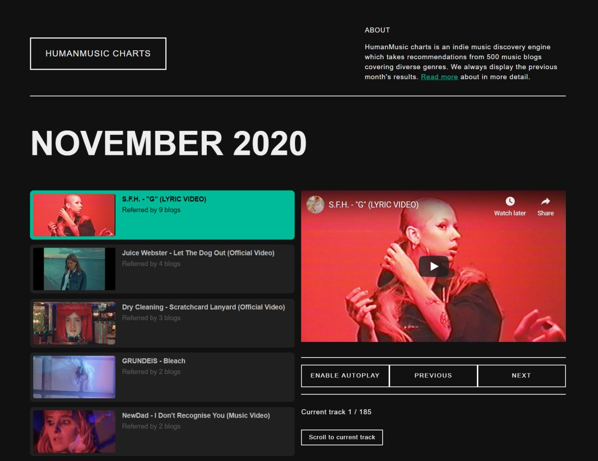

I've built [HumanMusic TV](https://humanmusic.tv/) in 2019 May to provide an experience that is similar to laid back TV watching experience. No more thinking about what to listen to, just open it in the browser and after a click, something will play.

What I was missing is a way to easily source new videos that will make it to the playlist. I didn't have to look too far to solve this problem. In 2013 I've built CloudDeck, which had a discovery engine built into it that looked for SoundCloud links on hundreds of music blogs. This is what I needed new again, but for YouTube.

### Why listen to this instead of Spotify Weekly?
I don't try to compete with Spotify, Deezer, or the YouTube recommendation algorithm. What I'd like to achieve with this new service is to organize fresh music. I mentioned Spotify Weekly specifically because Charts is the exact opposite of it. I don't really like living in a bubble of any kind, so relying on what machine learning algorithms think I'll dig is similar to tunnel vision.

HumanMusic Charts takes recommendations from music blogs because people who curate these blogs already act like a quality filter. Based on this group of music enthusiasts I believe this service could fill a unique niche.

### How it works
New charts are displayed at the beginning of each month, showcasing what it discovered in the last 30 days. The page only displays videos that were uploaded to YouTube in the relevant month of the year.

Videos that appear on Charts are not automatically added to HumanMusic TV, but there's a great chance that they will if the music and the video both are interesting in a way. It remains a subjective and manual process.

Take a listen at https://humanmusic.tv/charts/

### Why I love indie music videos
It's fairly easy to record, edit, and publish videos today in great quality. With a bit of experience anyone can make music videos. Bands already know that to stand out from the crowd they gotta be creative if they can't burn serious money on clips like the top performes on YouTube.

To stand out and stay on - the usually razor thin - budget, their only option is to crank up the creativity dial. If you watch a few clips on HumanMusic TV, it's fairly easy to notice this trend. So no Katy Perry, but more Kelly Lee Owens.

<iframe width="560" height="315" src="https://www.youtube-nocookie.com/embed/RKGbveD_cuE" frameborder="0" allow="accelerometer; autoplay; clipboard-write; encrypted-media; gyroscope; picture-in-picture" allowfullscreen></iframe>
