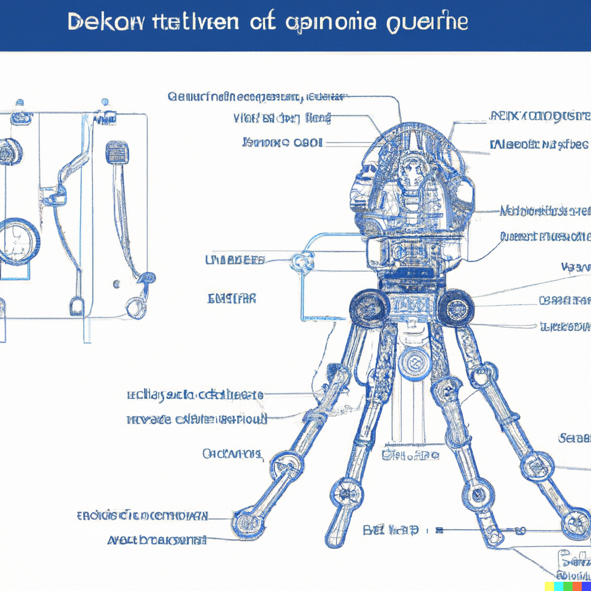

## Intro

I've had an idea about our octopus friends, what if they could walk among us with the help of some fancy exoskeleton tech? This remained a fun little thought, until DALL-E 2 came along. The massive dataset it was trained on makes things possible that we previously thought were impossible. I'm not going to explain in details how it works, the scope of the post is to show you how well it can help to explore a concept. In case you are interested, [here's a technical explanation](https://www.assemblyai.com/blog/how-dall-e-2-actually-works/) about how DALL-E 2 works in-depth.

With some gross oversimplifications, DALL-E only needs a text prompt which it then turns into a vector representation which is then used to look up configurations in a multi dimensional image model. It's like finding a magic key to retrieve almost anything from a magic library humans visually ever created. It was trained on 250 million images and it generated 12 billion parameters ([source](https://ml.berkeley.edu/blog/posts/dalle2/#fun-fact-dall-e-is-meant-to-be-a-combination-of-wall-e-and-salvador-dal%C3%AD)). It's mind boggling what it can do, we are in sci-fi movie territory :)

## Before we start

From now on you'll only see DALL-E generated images, some of them are edited with DALL-E's internal editing tool to regenerate certain details. An external photo editing program was only used to downscale the whole image to frame the picture better and let the AI generate more details about the surroundings.

**Trigger warning**: I'll use anthropomorphic terms for convenience in this post.

The prompt is based on the following root phrase:

    An octopus wearing a robotic exoskeleton walking on the street

In each section there are some modifications applied to the above phrase to achieve the desired effect.

## Exoskeleton technology

But let's not run ahead of ourselves, meet the exoskeleton tech first. In order for octopuses to walk free in our world, they need some kind of second skin to exist in. Since they have no bones, this must be made of something light and tough material, like carbon-fibre or some metal alloy.

A good engineering projects starts with planning, so let's review the blueprints first. I've asked DALL-E to create some engineering plans for this machinery. I wanted to test if it can reduce this concept to the most basic levels. For some reason, the mechanical nature of the suit and and the anatomy of the animal mixed really well in the mind of DALL-E. (_I warned you_)

As you can see, DALL-E is rather bad at generating text, it's best to just handle them as _lorem ipsum_.

## Style tags and fine tuning

This is where the fun begins. The original prompt looks like this:

> An octopus wearing a robotic exoskeleton walking on the street

Let's turn it into an artwork:

> An octopus wearing a robotic exoskeleton walking on the street, _digital art_

Adding this simple tag yields the results in the next section.

### Digital art

It's a fairly generic term, but usually brings good results. Some of these look like concept art or could work as game illustration.

### Tuning up fidelity with Unreal engine

I replaced digital art with Unreal engine which enhances the quality of the output significantly, I also added reference to the material of the suit.

> An octopus wearing a _shiny_ robotic exoskeleton walking on the street, _rendered in unreal engine_

I used the above prompt with slight variations and I probably should have added a reference to their sizes :)

Meet the good guys who use the zebra crossing :)

### Gameplay screenshots

I've added gameplay and screenshot to the mix to steer the direction to something more abstract. It did change things, for example the first image looks kinda like a Half-life character.

These characters would fit neatly into many games, there are probably something similar out there already that I'm unaware of.

> An octopus walking on a city street wearing a shiny robotic exoskeleton, gameplay screenshot

Adding back unreal engine again to the prompt changed the setting again. The first one is pretty terrifying, I'm not sure I like that it's running at me.

This is a bit glitchy one, but I wanted to showcase lesser good examples as well. This contains no edits. I like the vibe of it though, the framing is also nice. After regenerating some legs and building parts it would look much better.

This one is also unedited, really cool outcome.

### Talking with somebody

I thought that instead of just walking aimlessly on the streets, they should ask for directions. DALL-E now needs to reach out to the concept of what a conversation is and how its participants should behave. I've got many failure cases here and this was generally true as I increased the challenge.

DALL-E can do this easily since it's based on machine learning concept called transformers. Quoting from the analytical article:

> By using dense vector representations, transformers are able to express rich relationships between words, phrases, and contexts.
>
> — [source article](https://ml.berkeley.edu/blog/posts/dalle2/)

Let's change _walking on the street_ to _talking to a man_

> An octopus talking to a man on a city street wearing a shiny robotic exoskeleton, game screenshot powered by unreal engine

I like the industrial apartment block lurking in the background.

This has awesome alien vibes, but size should have been definitely a requirement :)

## Twisting the story

What if we add some power dynamics and see what happens. I've specified that tha man is a detective.

> An octopus wearing a shiny robotic exoskeleton talking to a detective man, game screenshot powered by unreal engine

The black dude looks like a nice game character.

Uh-uh someone got busted. I totally love the dramatic atmosphere of this one.

### Messing with time

I didn't like futuristic nature of the human's outfit so I changed them to something more familiar. To achieve this, I added _from the 50's_ to the mix.

It definitely twisted more than I expected, but I it gave me further ideas you'll see in a bit.

> An octopus wearing a steampunk exoskeleton talking to a detective man from the 50's, game screenshot powered by unreal engine

This is a weird one, the framing is too intense, but I like the mystery part of it. It also makes me wonder, what's on that picture leaning on the wall?

### Steampunk style

The first image from the previous section looked like a steampunk invention, so I checked what would these things look like if they were invented in the steam era.

Interesting, is that an early octopiphone?

## That's all folks

I hope you enjoyed this little trip to this universe :)

Although it's not yet time to be afraid of a bio-hacker octopus invasion, but there's a certain direction in which we are heading and that looks bright for them :)

_— [Nice to meet you!](https://twitter.com/tiborsaas)_

Here's some appendix content about assembly instructions, we can never get enough documentation :)

> Black and white instruction manual by IKEA on how to assemble an exoskeleton for octopuses

