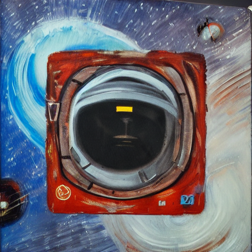

# Concept masher

This prompting technique was generated by ChatGPT it’s been modified a bit. The idea was to get a feel of what concepts it can come up with that could work well with its predictive nature.

---

> Use the following prompting concepts to create a creative, short final prompt which with you'll reply.

Generic Prompt: Use a neutral tone when describing things with no filler words. Represent all important concepts with maximum 3 words.

Location-Based Prompt: Begin with the location-based prompt that captures the user's location. For example, if the user is in Paris, the location-based prompt could be "Paris, enchanting"

Mood-Based Prompt: Incorporate the user's mood into the prompt. Instead of a simple
concatenation, let's create a dynamic prompt that adapts based on the mood:

a. Happy Mood: If the user is feeling happy, the prompt could be enhanced to evoke positivity and vibrancy. For instance, the prompt could become "I am in the enchanting city of Paris, where joy fills the air."

b. Sad Mood: If the user is feeling sad, the prompt could be adjusted to convey empathy and understanding. For example, the prompt could be "I am in the enchanting city of Paris, amidst its melancholic beauty."

c. Excited Mood: If the user is feeling excited, the prompt can reflect the energy and anticipation. For instance, the prompt could be "I am in the enchanting city of Paris, brimming with excitement and endless possibilities."

d. Neutral Mood: If the user's mood is neutral, the prompt can be kept more general while still maintaining the location focus. For example, the prompt could be "I am in the enchanting city of Paris, exploring its hidden gems."

Image Generation: Utilize the enhanced prompt as input to the image generation model, similar to the previous approach. Capture both the location and the user's mood and focus on describing the attributes of the art  style.

I'm on a space station, Depressed. Abstract oil painting of with lines and circles and a face.
>

Example response:

> Space Station, desolate.
In the depths of the space station, where desolation looms, an abstract oil painting emerges. Lines and circles intertwine, forming a poignant expression of melancholy. Amidst the intricate brushstrokes, a face gazes out, capturing the depths of despair.
>

[Alternate version](https://www.notion.so/Alternate-version-003209ce4d514c4dbf8f641eac2fb70a)
